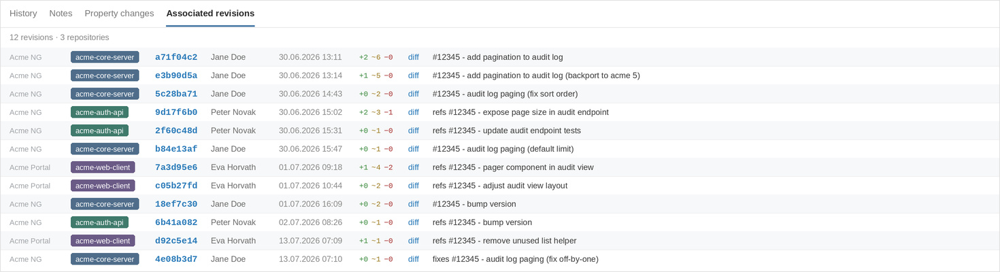

# redmine_commit_context

Compact, one-line rendering of the "Associated revisions" tab on the Redmine
issue view. Built for setups with many git mirror repositories attached to
projects, where the default two-line-per-revision layout — with no
indication of which repository a commit belongs to — becomes unusable once
an issue accumulates commits across several repositories.

Each revision is rendered as a single row:

`[repo-badge] [short sha] [author] [date time] +A ~M −D [diff] commit message`

with a header showing `N revisions · M repositories`.



*Twelve revisions across three repositories and two projects on a single issue.*

## Revisions for a version

The version show page (`/versions/:id`) lists every revision linked to an
issue belonging to that version — same compact rendering, same file-summary
header, paginated, with a CSV export link.


## Revisions for a filter

The issues index sidebar gets a "Show revisions for this filter" link that
opens a page listing the revisions linked to whatever the current issue
filter matches — a saved query, an ad-hoc URL filter, or a cross-module tag
filter like `sprint:current`. Filtering is entirely delegated to
`IssueQuery`, the same class and the same `retrieve_query` call
`IssuesController#index` itself uses, so anything that works as an issue
filter works here without any extra code in this plugin.


Above the list on both pages, an aggregated summary shows how many distinct
files were touched and across how many repositories (e.g. "40 files in 3
repositories"), with a collapsible per-repository breakdown.

The link — and the page behind it — only appear for a user who has
`:view_changesets` in at least one visible project; a direct hit on the URL
without that permission gets a 403 (or a login redirect for anonymous
users), independent of whether the link was ever shown. `Changeset.visible`
is applied to every query behind these pages, so a filter or version that
spans multiple projects never surfaces a changeset from a repository the
current user cannot see, even if the linked issue itself is visible to them.

## Installation

```sh
cd redmine/plugins
git clone https://github.com/4Q-s-r-o/redmine_commit_context.git
cd ..
bundle install
```

No database migrations are required — the plugin does not add any tables,
it only reads existing changeset/repository data. Restart Redmine after
installing.

## Compatibility

Tested in CI against Redmine `6.0-stable` and `6.1-stable` (see
`.github/workflows/test.yml`). Requires Redmine 6.0 or higher
(`requires_redmine version_or_higher: '6.0.0'` in `init.rb`).

`7.0-stable` exists upstream at the time of writing but has not been
verified against this plugin — check the view override note below before
relying on it there.

## View override — read before upgrading Redmine

Redmine core does not expose a hook that allows replacing (only appending
to) the rendering of each revision in the "Associated revisions" tab. The
only hook available there, `view_issues_history_changeset_bottom`, fires
*after* the default two-line block for each changeset has already been
rendered — it cannot suppress or restructure that output. Because the goal
of this plugin is a full one-line replacement of that layout, it overrides
the core partial directly:

```
app/views/issues/tabs/_changesets.html.erb
```

This works through Redmine's own plugin loading mechanism
(`ActionController::Base.prepend_view_path`, see `lib/redmine/plugin.rb` in
core) — the plugin's `app/views` directory is searched before core's, so a
file at the same relative path overrides it. No core file is patched and no
`alias_method_chain` is used.

The override file itself is a thin wrapper: the actual row-by-row rendering
lives in the shared partial `app/views/commit_context/_revisions.html.erb`,
reused by the version and filter pages below. The wrapper's own job is just
to pass through `changesets`/`project` and to call
`call_hook(:view_issues_history_changeset_bottom, changeset: changeset)`
after each row, exactly where core calls it, via an `after_row` callback
the shared partial accepts for this one purpose — any other installed
plugin that relies on that hook to append content per changeset keeps
working, and the version/filter pages (which have no such per-issue hook
context) simply don't pass one.

**What to check on every Redmine upgrade:** diff this file against the
corresponding `app/views/issues/tabs/_changesets.html.erb` in the new
Redmine version. Between 6.0 and 6.1 the only change was CSS class
renaming; a future version could change the controller contract (locals
passed into the partial: `changesets`, `project`), the permission checks,
or add fields the override should also expose. If `_changesets.html.erb`
no longer exists at that path, the tab has been restructured and this
plugin will need updating.

## Permissions

The version and filter pages, and the sidebar link to the latter, are gated
on `:view_changesets` rather than `:browse_repository`. This is deliberate:
`Changeset.visible` — the scope mandatory on every query behind these pages
— itself filters on `:view_changesets`, so gating the entry point on a
different permission would decouple what a user can *reach* from what they
can actually *see* once there. `:browse_repository` is still checked, as
before, per row, to decide whether that row's diff link is shown.

See `lib/redmine_commit_context/permissions.rb` and
`lib/redmine_commit_context/revision_scopes.rb`.

## How the data is loaded

- `IssuesController#issue_tab` already preloads `repository` and `user` on
  the changeset list (`preload(:repository, :user)`), so there is no N+1
  there.
- It does **not** preload `filechanges`. Since the controller cannot be
  patched, the plugin fetches file-change counts for the whole visible
  changeset list in a single aggregated query
  (`Change.where(changeset_id: ids).group(:changeset_id, :action).count`,
  see `lib/redmine_commit_context/change_stats.rb`) instead of calling
  `changeset.filechanges` per row.
- Repository badge colors are derived deterministically from the
  displayed identifier (`Digest::MD5.hexdigest(identifier).to_i(16) % 8`),
  so the same repository always gets the same color across reloads and
  users. Repository identifiers are only unique *within* a project, so two
  repositories in different projects with the same identifier (or the same
  URL basename fallback, e.g. `.../team-a/shared.git` and
  `.../team-b/shared.git`) show an identical badge. When a changeset
  belongs to a different project than the issue itself, the row also shows
  that project's name — the same disambiguation core's own partial uses —
  so same-looking badges from different projects stay distinguishable. Set
  an explicit, project-unique repository identifier to also make the badge
  text itself differ.

Everything is read from the Redmine database. Nothing shells out to `git`,
and nothing touches branches, deployment status, or code review data.

## Testing

```sh
bundle exec rake redmine:plugins:test NAME=redmine_commit_context
```

Run from the Redmine root, with the plugin checked out under `plugins/`.

## Planned (out of scope for this MVP)

- Deployment badge derived from git tags in the `<environment>/<version>`
  format.
- Filtering the revisions list by repository.

## License

GPL-2.0, same as Redmine core. See `LICENSE`.
